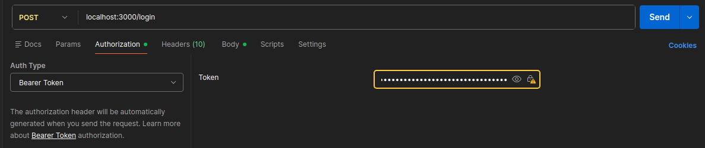

# Manual de Instalação Aerocode

## Requisitos

- Node.js
- TypeScript
- MySQL

## Instalação

### 1. Criar o banco de dados

No MySQL, execute:

```sql
create database aerocode;
```

### 2. Clonar o repositório

```bash
git clone https://github.com/hiGuigo/AV3-TPI.git
```

### 3. Acessar o diretório do projeto

```bash
cd AV3-TPI
cd backend
```

### 4. Instalar as dependências

```bash
npm install
```

### 5. Criar o arquivo `.env`

```bash
cp .env.sample .env
```

### 6. Configurar as variáveis de ambiente

Preencha o arquivo `.env` com as credenciais do seu banco:

```env
DATABASE_HOST=
DATABASE_USER=
DATABASE_PASSWORD=
DATABASE_NAME=
```

E defina a sua assinatura para o JWT:

```env
JWT_SECRET=
```

### 7. Crie o cliente do prisma

```bash
npx prisma generate
```

### 8. Execute a migração do prisma

```bash
npx prisma migrate dev
```

### 9. Execute a seed para criar o primeiro usuário

```bash
npx prisma db seed
```

### 10. Iniciar o servidor em modo de desenvolvimento

```bash
npm run dev
```

## Servidor

Após iniciar a aplicação, o servidor estará disponível em:

```text
http://127.0.0.1:3000
```

## Testes

Caso queira testar as rotas por meio de um aplicativo:

1. Faça login pela rota

```json
{
  "username": "admin",
  "senha": "admin"
}
```

2. Copie o token e cole em Bearer Token (Autorization)



3. Com o token de administrador, será possível testar todas as rotas através do aplicativo
