# Relatório de Testes Aerocode

## 1. Introdução

Este relatório apresenta testes de desempenho realizados na aplicação, com o objetivo de analisar seu comportamento durante múltiplas requisições simultâneas. Foram coletadas métricas de latência, tempo de resposta e tempo de processamento em cenários com diferentes quantidades de usuários.

A realização desses testes tem como objetivo verificar a estabilidade, o desempenho e a capacidade do sistema de continuar funcionando corretamente sob carga, além de validar a qualidade da aplicação desenvolvida.

```
Latência: representa o tempo inicial necessário para que a requisição comece a ser processada pelo servidor.

Tempo de processamento: representa quanto tempo o backend leva efetivamente executando lógica interna da aplicação.

Tempo de resposta: representa o tempo total até a entrega final da resposta ao cliente.
```

## 2. Metodologia

O resultado da latência foi obtido no relatório pós-processamento do autocannon.

```
| Stat    │ 2.5% │ 50%  │ 97.5% │ 99%  │ Avg     │ Stdev   │ Max    │
├─────────┼──────┼──────┼───────┼──────┼─────────┼─────────┼────────┤
│ Latency │ 1 ms │ 1 ms │ 3 ms  │ 5 ms │ 1.59 ms │ 2.92 ms │ 192 ms |
```

Para calcular o tempo de processamento interno da aplicação, foi utilizada uma lógica simples dentro do método responsável pela regra de negócio.

```ts
async findAll() {
    const inicioProcessamento = performance.now();

    const usuarios = await this.usuarioRepository.findMany();

    const fimProcessamento = performance.now();

    const tempoProcessamento = fimProcessamento - inicioProcessamento;

    console.log(
      `[Service] findAll executado em ${tempoProcessamento.toFixed(2)} ms`,
    );

    return usuarios;
  }
```

Para medir o tempo de resposta da requisição, foi utilizado um hook global do Fastify responsável por capturar o início e o fim do ciclo da requisição utilizando "performance.now()". O tempo total foi calculado em milissegundos e registrado durante a execução das rotas da aplicação.

**Hook "onRequest", executado quando a requisição chega no servidor:**

```ts
fastify.addHook("onRequest", async (req, reply) => {
  req.inicio = performance.now();
});
```

**Hook "onResponse", executado no fim da requisição:**

```ts
let totalTempo = 0;
let totalRequisicoes = 0;

fastify.addHook("onResponse", async (req, reply) => {
  const fim = performance.now();

  const tempo = fim - req.inicio;

  totalTempo += tempo;
  totalRequisicoes++;

  console.log(
    `[${reply.statusCode}] ${req.method} ${req.url} - ${tempo.toFixed(2)} ms`,
  );

  console.log(
    `Tempo médio de resposta da requisição: ${(totalTempo / totalRequisicoes).toFixed(2)} ms`,
  );
});
```

Os testes de desempenho foram realizados utilizando a ferramenta autocannon, executando requisições HTTP simultâneas contra a API Fastify localmente. Foram simulados **cenários** com **1, 5 e 10 usuários simultâneos durante 10 segundos**. As métricas coletadas foram latência, tempo de resposta e tempo de processamento, todas medidas em milissegundos.

**Exemplo de comando para teste com 5 usuários simultâneos:**

```bash
npx autocannon -H "Authorization: Bearer TOKEN_JWT" -c 5 -d 10 http://localhost:3000/usuarios
```

Como o sistema conta com a utilização de JWT, para segurança, é necessário informar, além de quantidade de usuários, tempo e requisição, o token obtido no login. Para obter o token mais facilmente, basta utilizar qualquer programa de testes de APIs (Postman, Insomnia...):

```
Método: POST
Rota: /login
Body: {
    "username": "seu_nome_de_usuario",
    "senha": "sua_senha"
}
```

## 3. Endpoints analizados

```
GET /usuarios

GET /aeronaves

GET /etapas

GET /funcionarios

GET /pecas

GET /relatorios

GET /testes
```

## 4. Resultados

### 4.1. GET /usuarios

**1 Usuário:**

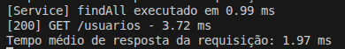


**5 Usuários:**

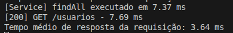


**10 usuários:**

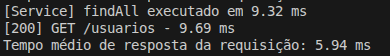


### 4.2. GET /aeronaves

**1 Usuário:**

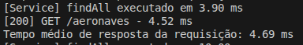

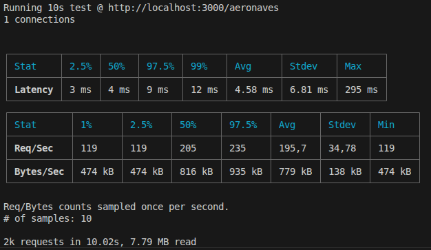

**5 Usuários:**

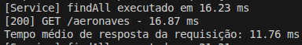

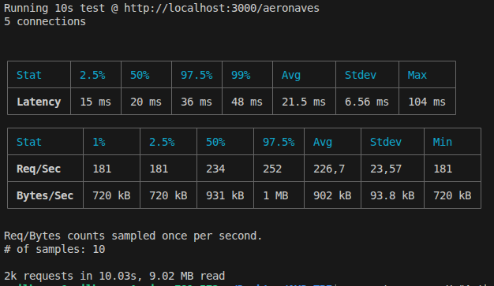

**10 Usuários:**

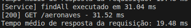

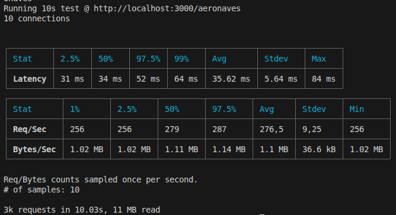

### 4.3. GET /etapas

**1 Usuário:**

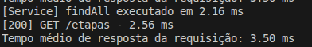

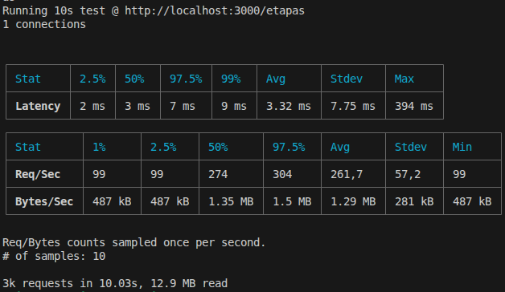

**5 Usuários:**

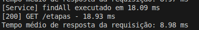

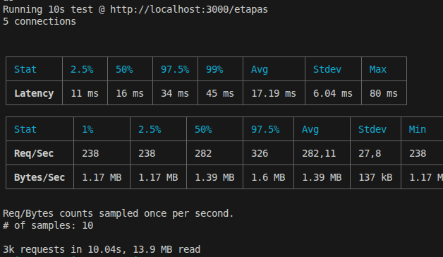

**10 Usuários:**

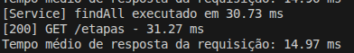

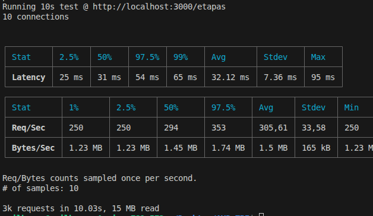

### 4.4. GET /funcionarios

**1 Usuário:**

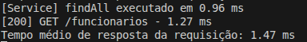

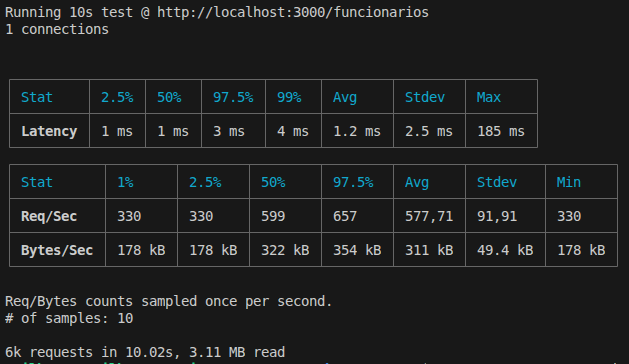

**5 Usuários:**

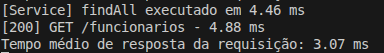

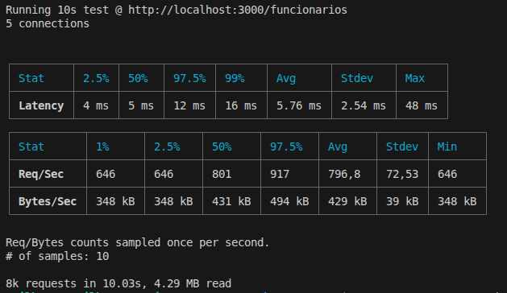

**10 Usuários:**

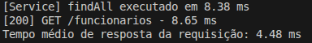

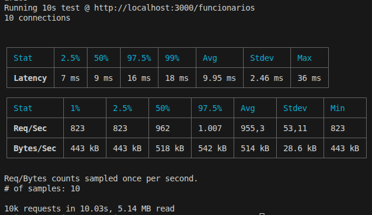

### 4.5. GET /pecas

**1 Usuário:**

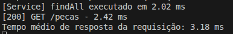

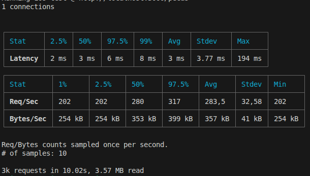

**5 Usuários:**

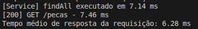

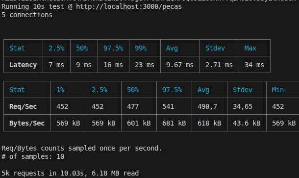

**10 Usuários:**

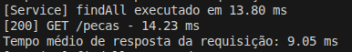

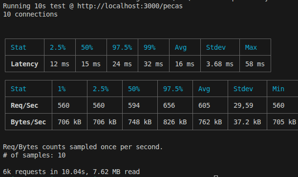

### 4.6. GET /relatorios

**1 Usuário:**

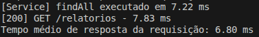

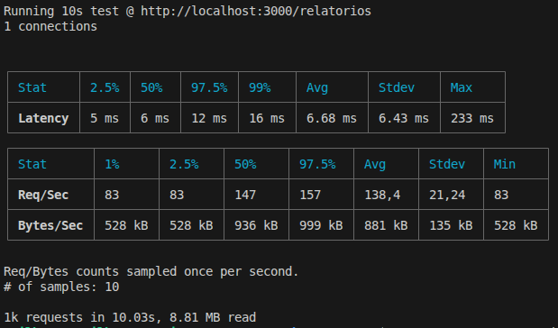

**5 Usuários:**

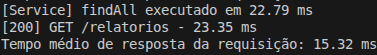

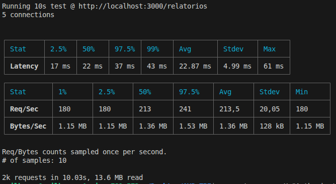

**10 Usuários:**

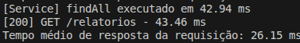

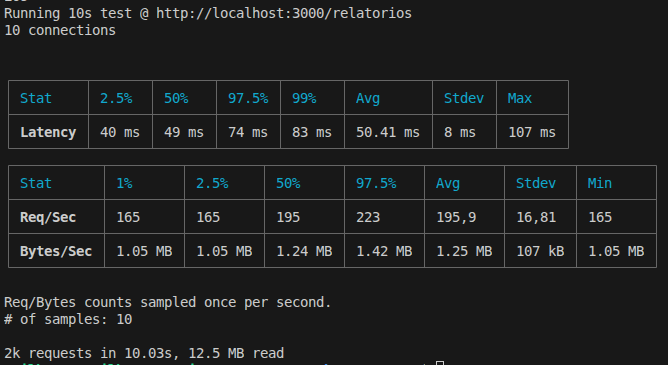

### 4.7. GET /testes

**1 Usuário:**

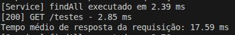

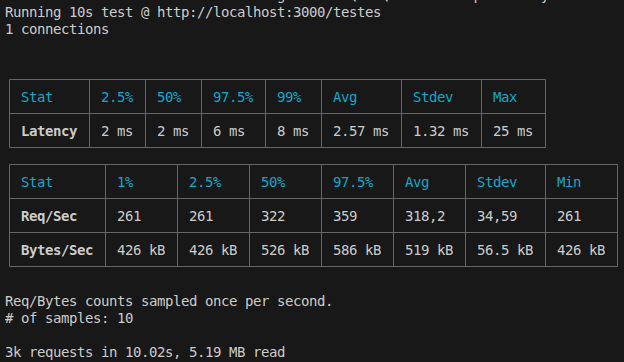

**5 Usuários:**

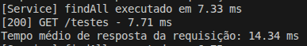

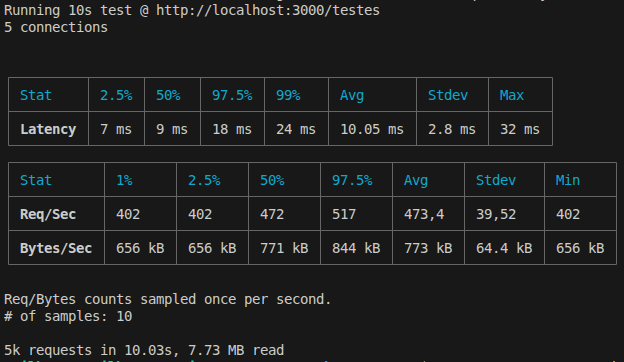

**10 Usuários:**

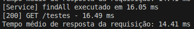

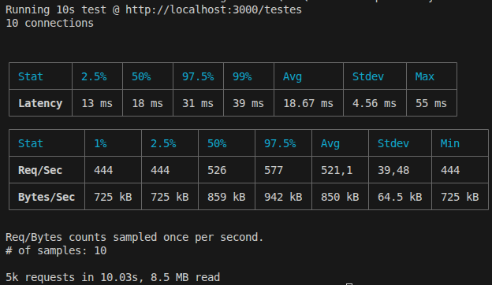

## 5. Tratamento dos dados

### 5.1. GET /usuarios

**Visão Geral:**

| Quantidade de usuários | Latência | Tempo de processamento | Tempo de resposta |
| ---------------------- | -------: | ---------------------: | ----------------: |
| 1 usuário              |  1.76 ms |                0.99 ms |           1.97 ms |
| 5 usuários             |  6.22 ms |                7.37 ms |           3.64 ms |
| 10 usuários            |  11.5 ms |                9.32 ms |           5.94 ms |

**Gráfico:**

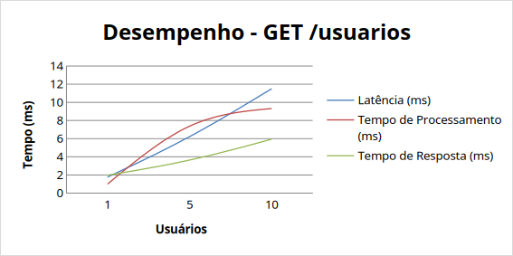

### 5.2 GET /aeronaves

**Visão Geral:**

| Quantidade de usuários | Latência | Tempo de processamento | Tempo de resposta |
| ---------------------- | -------: | ---------------------: | ----------------: |
| 1 usuário              |  4.58 ms |                 3.9 ms |           4.69 ms |
| 5 usuários             |  21.5 ms |               16.23 ms |          11.76 ms |
| 10 usuários            | 35.62 ms |               31.04 ms |          19.48 ms |

**Gráficos:**

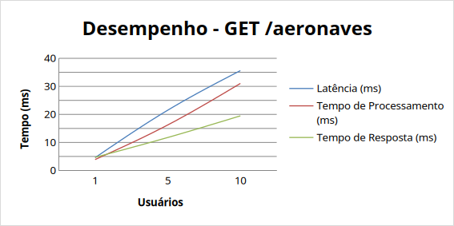

### 5.3 GET /etapas

**Visão Geral:**

| Quantidade de usuários | Latência | Tempo de processamento | Tempo de resposta |
| ---------------------- | -------: | ---------------------: | ----------------: |
| 1 usuário              |  3.32 ms |                2.16 ms |            3.5 ms |
| 5 usuários             | 17.19 ms |                18.9 ms |           8.98 ms |
| 10 usuários            | 32.12 ms |               30.73 ms |          14.97 ms |

**Gráfico:**

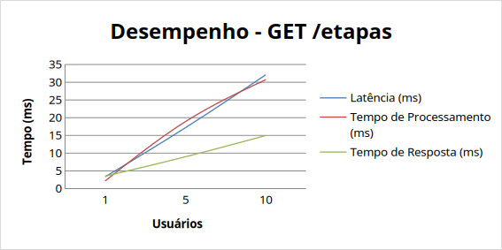

### 5.4 GET /funcionarios

**Visão Geral:**

| Quantidade de usuários | Latência | Tempo de processamento | Tempo de resposta |
| ---------------------- | -------: | ---------------------: | ----------------: |
| 1 usuário              |   1.2 ms |                0.96 ms |           1.47 ms |
| 5 usuários             |  5.76 ms |                4.46 ms |           3.07 ms |
| 10 usuários            |  9.95 ms |                8.38 ms |           4.48 ms |

**Gráfico:**

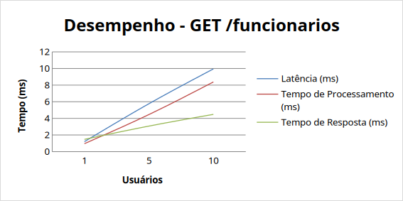

### 5.5 GET /pecas

**Visão Geral:**

| Quantidade de usuários | Latência | Tempo de processamento | Tempo de resposta |
| ---------------------- | -------: | ---------------------: | ----------------: |
| 1 usuário              |     3 ms |                2.02 ms |           3.18 ms |
| 5 usuários             |  9.67 ms |                7.14 ms |           6.28 ms |
| 10 usuários            |    16 ms |                13.8 ms |           9.05 ms |

**Gráfico:**

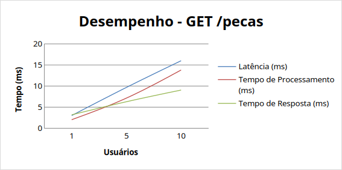

### 5.6 GET /relatorios

**Visão Geral:**

| Quantidade de usuários | Latência | Tempo de processamento | Tempo de resposta |
| ---------------------- | -------: | ---------------------: | ----------------: |
| 1 usuário              |  6.68 ms |                7.22 ms |            6.8 ms |
| 5 usuários             | 22.87 ms |               22.79 ms |          15.32 ms |
| 10 usuários            | 50.41 ms |               42.94 ms |          26.15 ms |

**Gráfico:**

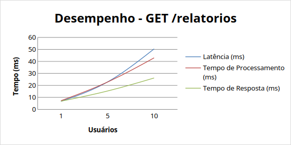

### 5.7 GET /testes

**Visão Geral:**

| Quantidade de usuários | Latência | Tempo de processamento | Tempo de resposta |
| ---------------------- | -------: | ---------------------: | ----------------: |
| 1 usuário              |  2.57 ms |                2.39 ms |          17.59 ms |
| 5 usuários             | 10.05 ms |                7.33 ms |          14.34 ms |
| 10 usuários            | 18.67 ms |               16.05 ms |          14.41 ms |

**Gráfico:**

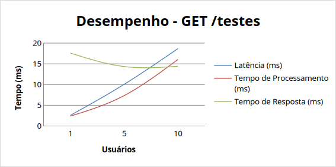

## 6. Análise dos resultados

### 6.1 GET /usuarios

**1. Latência**

- A latência apresentou crescimento gradual conforme o aumento da carga, mantendo comportamento previsível ao longo dos cenários avaliados.
- O aumento observado indica que o endpoint absorve o acréscimo de usuários simultâneos sem degradações abruptas.
- O comportamento sugere boa escalabilidade para as cargas analisadas, sem indícios de gargalos significativos.

**2. Tempo de processamento**

- O tempo de processamento evoluiu de 0.99 ms → 7.37 ms → 9.32 ms.
- O crescimento do processamento acompanhou o aumento da concorrência, mantendo-se proporcional à carga aplicada.
- A evolução demonstra capacidade adequada de processamento, sem evidências de saturação dos recursos da aplicação.

**3. Tempo de resposta**

- O tempo de resposta aumentou de forma consistente à medida que a quantidade de usuários cresceu.
- O comportamento observado indica estabilidade durante toda a execução dos testes.
- A experiência do usuário tende a permanecer satisfatória mesmo sob maior concorrência, devido à manutenção de tempos reduzidos de resposta.

**4. Visão geral e considerações**

- O endpoint apresentou comportamento estável em todos os cenários analisados.
- Os indicadores demonstram boa capacidade de escalabilidade para as cargas testadas.
- Não foram observados sinais de degradação acentuada de desempenho.
- O crescimento dos indicadores ocorreu de forma proporcional ao aumento da carga, sugerindo eficiência na implementação da operação de consulta.

### 6.2 GET /aeronaves

**1. Latência**

- A latência apresentou crescimento expressivo conforme o aumento da quantidade de usuários simultâneos.
- Apesar do aumento mais acentuado em comparação a outros endpoints, o comportamento permaneceu previsível e proporcional à carga.
- Os resultados indicam que o endpoint suporta o crescimento da demanda, embora apresente maior sensibilidade ao aumento da concorrência.

**2. Tempo de processamento**

- O tempo de processamento evoluiu de 3.9 ms → 16.23 ms → 31.04 ms.
- Houve crescimento contínuo do esforço computacional necessário para atender às requisições.
- O comportamento sugere que a operação possui maior custo de processamento quando comparada a endpoints mais simples.

**3. Tempo de resposta**

- O tempo de resposta aumentou de forma consistente com o crescimento da carga.
- Não foram observadas oscilações ou comportamentos anormais durante os testes.
- O endpoint manteve estabilidade operacional mesmo sob maior concorrência.

**4. Visão geral e considerações**

- O endpoint apresentou comportamento estável e previsível.
- Os indicadores apontam escalabilidade adequada para as cargas analisadas.
- O crescimento mais acentuado da latência e do processamento sugere maior complexidade na consulta ou no volume de dados manipulados.
- Não foram identificados indícios de saturação ou perda significativa de desempenho.

### 6.3 GET /etapas

**1. Latência**

- A latência aumentou progressivamente conforme a carga foi ampliada.
- O comportamento demonstra relação direta entre concorrência e tempo necessário para atendimento das requisições.
- Apesar do crescimento, os resultados permaneceram consistentes e sem evidências de gargalos críticos.

**2. Tempo de processamento**

- O tempo de processamento evoluiu de 2.16 ms → 18.9 ms → 30.73 ms.
- O aumento foi significativo entre os cenários avaliados, acompanhando o crescimento da carga.
- O endpoint demonstrou capacidade de processar múltiplas requisições simultâneas sem degradação abrupta.

**3. Tempo de resposta**

- O tempo de resposta apresentou crescimento gradual e previsível.
- A evolução observada indica comportamento estável sob diferentes níveis de concorrência.
- Os resultados sugerem manutenção de uma experiência satisfatória para o usuário mesmo em cenários mais exigentes.

**4. Visão geral e considerações**

- O endpoint apresentou boa estabilidade durante toda a execução dos testes.
- O crescimento dos indicadores ocorreu de forma proporcional ao aumento da carga.
- Não foram observados comportamentos que indiquem gargalos severos ou limitação imediata de escalabilidade.
- Os resultados demonstram capacidade adequada de atendimento para os níveis de concorrência avaliados.

### 6.4 GET /funcionarios

**1. Latência**

- A latência apresentou crescimento moderado e controlado conforme a carga aumentou.
- O comportamento demonstra elevada eficiência no atendimento das requisições.
- O endpoint manteve estabilidade mesmo com o aumento da concorrência.

**2. Tempo de processamento**

- O tempo de processamento evoluiu de 0.96 ms → 4.46 ms → 8.38 ms.
- O crescimento ocorreu de forma proporcional à carga aplicada.
- Os resultados indicam baixo custo computacional para execução da operação.

**3. Tempo de resposta**

- O tempo de resposta permaneceu reduzido em todos os cenários avaliados.
- O crescimento observado acompanhou o aumento da quantidade de usuários simultâneos sem comprometer a consistência do endpoint.
- O comportamento sugere boa capacidade de atendimento sob carga.

**4. Visão geral e considerações**

- O endpoint apresentou um dos melhores desempenhos entre os cenários analisados.
- Os indicadores evidenciam elevada estabilidade e boa escalabilidade.
- O crescimento dos tempos ocorreu de forma controlada e previsível.
- Não foram identificados sinais de gargalos ou degradação relevante de desempenho.

### 6.5 GET /pecas

**1. Latência**

- A latência apresentou crescimento gradual à medida que a carga aumentou.
- O comportamento manteve-se estável e proporcional à quantidade de usuários simultâneos.
- Não foram observadas variações que indiquem problemas de escalabilidade nas cargas avaliadas.

**2. Tempo de processamento**

- O tempo de processamento evoluiu de 2.02 ms → 7.14 ms → 13.8 ms.
- Houve aumento consistente do processamento conforme a concorrência cresceu.
- O endpoint demonstrou capacidade adequada para absorver o aumento da demanda.

**3. Tempo de resposta**

- O tempo de resposta apresentou crescimento contínuo e previsível.
- O comportamento observado indica estabilidade durante todos os cenários de teste.
- Os resultados sugerem manutenção de boa experiência para os usuários mesmo sob maior carga.

**4. Visão geral e considerações**

- O endpoint apresentou desempenho estável em todos os cenários analisados.
- A evolução dos indicadores demonstra escalabilidade adequada para os níveis de concorrência avaliados.
- O crescimento dos tempos ocorreu de forma proporcional ao aumento da carga.
- Não foram observados indícios de degradação significativa de desempenho.

### 6.6 GET /relatorios

**1. Latência**

- A latência apresentou o crescimento mais acentuado entre os endpoints analisados.
- O aumento indica maior sensibilidade à concorrência e possível complexidade adicional na operação executada.
- Apesar disso, o comportamento permaneceu previsível e proporcional à carga aplicada.

**2. Tempo de processamento**

- O tempo de processamento evoluiu de 7.22 ms → 22.79 ms → 42.94 ms.
- Houve aumento significativo do processamento conforme o número de usuários simultâneos cresceu.
- Os resultados indicam maior demanda de recursos computacionais em comparação aos demais endpoints.

**3. Tempo de resposta**

- O tempo de resposta aumentou progressivamente em todos os cenários.
- O comportamento permaneceu consistente, sem oscilações inesperadas.
- A experiência do usuário tende a ser impactada de forma gradual conforme a carga aumenta, mas sem evidências de degradação crítica.

**4. Visão geral e considerações**

- O endpoint apresentou estabilidade durante toda a execução dos testes.
- Os indicadores sugerem maior complexidade operacional em relação aos demais endpoints avaliados.
- O crescimento mais elevado dos tempos merece acompanhamento em cenários de carga superiores.
- Não foram observados sinais de falha ou saturação para os níveis de concorrência analisados.

### 6.7 GET /testes

**1. Latência**

- A latência apresentou crescimento gradual conforme a carga aumentou.
- O comportamento permaneceu previsível e proporcional à quantidade de usuários simultâneos.
- Não foram observados indícios de instabilidade ou gargalos relevantes.

**2. Tempo de processamento**

- O tempo de processamento evoluiu de 2.39 ms → 7.33 ms → 16.05 ms.
- O crescimento acompanhou o aumento da concorrência de forma consistente.
- Os resultados demonstram capacidade adequada de processamento sob carga crescente.

**3. Tempo de resposta**

- O tempo de resposta manteve comportamento relativamente estável entre os cenários avaliados.
- Diferentemente dos demais endpoints, houve pouca variação mesmo com o aumento da carga.
- Esse comportamento sugere que fatores distintos do processamento interno podem influenciar o tempo total de resposta da operação.

**4. Visão geral e considerações**

- O endpoint apresentou estabilidade durante toda a execução dos testes.
- A latência e o processamento cresceram de forma proporcional ao aumento da carga.
- O tempo de resposta manteve-se praticamente constante entre os cenários avaliados, caracterizando um comportamento particular em relação aos demais endpoints.
- Não foram identificados sinais de degradação significativa ou limitação de escalabilidade nas cargas analisadas.

## 7. Conclusão

Os testes de desempenho realizados nos endpoints do sistema aerocode demonstraram um comportamento estável e consistente diante do aumento gradual da carga de usuários simultâneos. Em todos os cenários avaliados, observou-se crescimento previsível dos indicadores de latência, tempo de processamento e tempo de resposta, sem ocorrências de degradação abrupta, falhas ou sinais de saturação. Esse comportamento evidencia que a aplicação é capaz de manter seu funcionamento de forma confiável mesmo sob condições de maior concorrência.

De modo geral, os resultados indicam que a arquitetura implementada apresenta boa capacidade de escalabilidade para as cargas analisadas, uma vez que o aumento da demanda foi acompanhado por variações proporcionais nos tempos medidos. Embora alguns endpoints tenham apresentado maior custo computacional em comparação aos demais, especialmente aqueles associados a operações mais complexas, o desempenho permaneceu dentro de padrões consistentes e sem comprometer a estabilidade do sistema.

Dessa forma, conclui-se que o sistema atende adequadamente aos requisitos de desempenho para os cenários de teste executados, demonstrando eficiência no processamento das requisições, previsibilidade no comportamento sob carga e capacidade de suportar múltiplos acessos simultâneos sem impactos significativos na experiência do usuário. Esses resultados reforçam a robustez da solução e fornecem evidências de sua aptidão para operar em ambientes com níveis moderados de concorrência.
