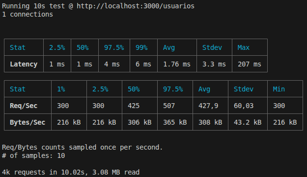
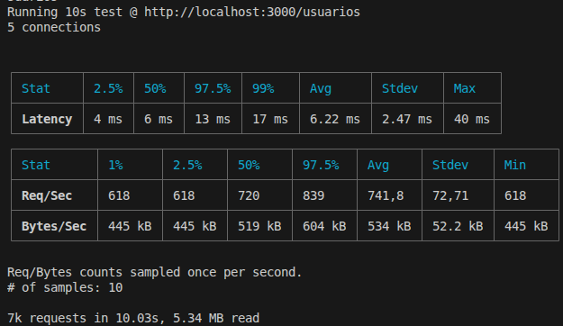
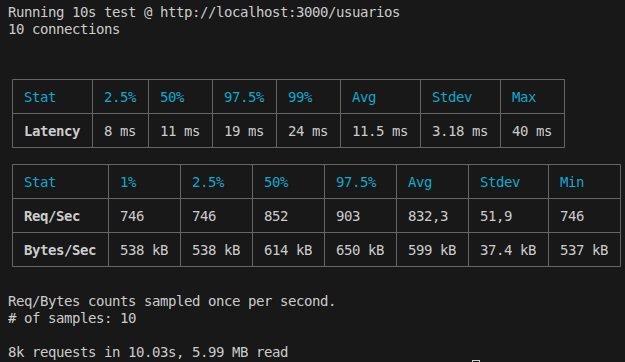

# Relatório de Testes Aerocode

## 1. Introdução

Este relatório apresenta testes de desempenho realizados na aplicação, com o objetivo de analisar seu comportamento durante múltiplas requisições simultâneas. Foram coletadas métricas de latência, tempo de resposta e tempo de processamento em cenários com diferentes quantidades de usuários.

A realização desses testes tem como objetivo verificar a estabilidade, o desempenho e a capacidade do sistema de continuar funcionando corretamente sob carga, além de validar a qualidade da aplicação desenvolvida.

```
Latência: representa o tempo inicial necessário para que a requisição comece a ser processada pelo servidor.

Tempo de processamento: representa quanto tempo o backend leva efetivamente executando lógica interna da aplicação.

Tempo de resposta: representa o tempo total até a entrega final da resposta ao cliente.
```

## 2. Metodologia

O resultado da latência foi obtido no relatório pós-processamento do autocannon.

```
| Stat    │ 2.5% │ 50%  │ 97.5% │ 99%  │ Avg     │ Stdev   │ Max    │
├─────────┼──────┼──────┼───────┼──────┼─────────┼─────────┼────────┤
│ Latency │ 1 ms │ 1 ms │ 3 ms  │ 5 ms │ 1.59 ms │ 2.92 ms │ 192 ms |
```

Para calcular o tempo de processamento interno da aplicação, foi utilizada uma lógica simples dentro do método responsável pela regra de negócio.

```
async findAll() {
    const inicioProcessamento = performance.now();

    const usuarios = await this.usuarioRepository.findMany();

    const fimProcessamento = performance.now();

    const tempoProcessamento = fimProcessamento - inicioProcessamento;

    console.log(
      `[Service] findAll executado em ${tempoProcessamento.toFixed(2)} ms`,
    );

    return usuarios;
  }
```

Para medir o tempo de resposta da requisição, foi utilizado um hook global do Fastify responsável por capturar o início e o fim do ciclo da requisição utilizando "performance.now()". O tempo total foi calculado em milissegundos e registrado durante a execução das rotas da aplicação.

**Hook "onRequest", executado quando a requisição chega no servidor:**

```
fastify.addHook("onRequest", async (req, reply) => {
  req.inicio = performance.now();
});
```

**Hook "onResponse", executado no fim da requisição:**

```
let totalTempo = 0;
let totalRequisicoes = 0;

fastify.addHook("onResponse", async (req, reply) => {
  const fim = performance.now();

  const tempo = fim - req.inicio;

  totalTempo += tempo;
  totalRequisicoes++;

  console.log(
    `[${reply.statusCode}] ${req.method} ${req.url} - ${tempo.toFixed(2)} ms`,
  );

  console.log(`Tempo médio de resposta da requisição: ${(totalTempo / totalRequisicoes).toFixed(2)} ms`);
});
```

Os testes de desempenho foram realizados utilizando a ferramenta autocannon, executando requisições HTTP simultâneas contra a API Fastify localmente. Foram simulados **cenários** com **1, 5 e 10 usuários simultâneos durante 10 segundos** para a rota **GET /usuarios**. As métricas coletadas foram latência, tempo de resposta e tempo de processamento, todas medidas em milissegundos.

**Exemplo de comando para teste com 5 usuários simultâneos:**

```
npx autocannon -H "Authorization: Bearer TOKEN_JWT" -c 5 -d 10 http://localhost:3000/usuarios
```

Como o sistema conta com a utilização de JWT, para segurança, é necessário informar, além de quantidade de usuários, tempo e requisição, o token obtido no login. Para obter o token mais facilmente, basta utilizar qualquer programa de testes de APIs (Postman, Insomnia...):

```
Método: POST
Rota: /login
Body: {
    "username": "seu_nome_de_usuario",
    "senha": "sua_senha"
}
```

## 3. Resultados

### Visão Geral:

| Quantidade de usuários | Latência | Tempo de processamento | Tempo de resposta |
| ---------------------- | -------: | ---------------------: | ----------------: |
| 1 usuário              |  1.76 ms |                0.99 ms |           1.97 ms |
| 5 usuários             |  6.22 ms |                7.37 ms |           3.64 ms |
| 10 usuários            |  11.5 ms |                9.32 ms |           5.94 ms |

### 1 Usuário:




### 5 Usuários:




### 10 usuários:




## 4. Análise dos Resultados

## 5. Conclusão
